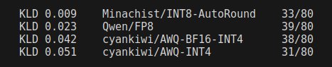
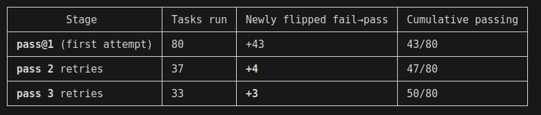
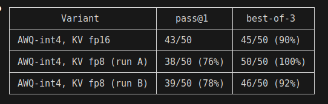
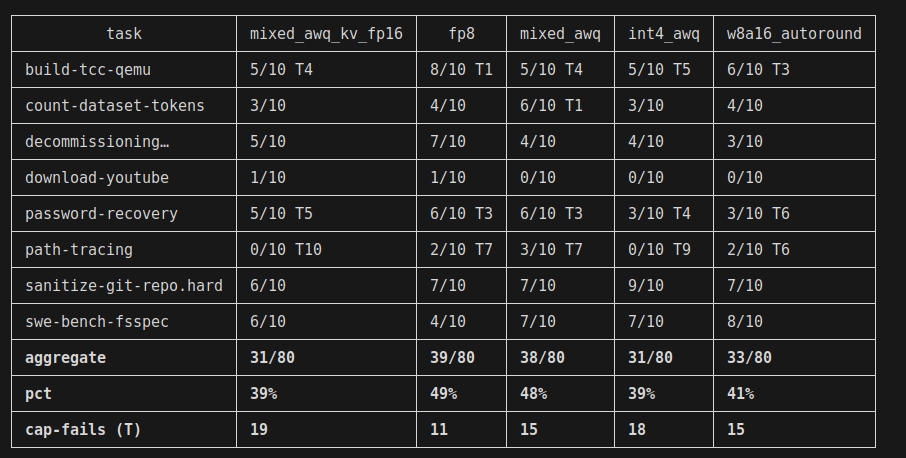
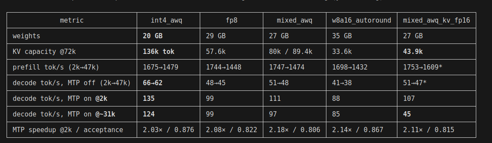

Dual 3090: Qwen3.6-27B
2026-06-05

I fell into the rabbit hole of optimizing Qwen3.6-27B to run as fast and reliably as possible. I found that most online advice focuses on speed - tokens per second - and largely ignores quality degradation. I'm sharing my journey and the lessons learnt.

My setup is dual-3090s or 48GB of VRAM. In local AI, VRAM is the limiting factor. Offload to system RAM is an option that exists but I think the speed is unworkable - it's fun to get started but can't really do anything useful. My goal here was to fit the model and the KV cache in 48GB. The full model with maximum context length requires ~70GB. This means some size optimizations are necessary. The real question is, at what point "size optimization" turns into "degradation optimization"?

A quick note on the setup: these benchmarks used the [tinygrad P2P driver patch](https://github.com/aikitoria/open-gpu-kernel-modules) to enable peer-to-peer over PCIe on the 3090s. Stock drivers disable this, so your mileage will vary.

How to measure degradation? There are basically two ways - the first one is to do simple metrics like calculating perplexity or KLD - measuring the difference in the produced tokens, compared to the baseline. The second one is an outcome-driven - performing task(s) at various levels of quantization and measuring at what point the tasks start to fail. I opted for the second option, because "diverging" from the baseline doesn't necessarily mean worse - the model can reach a goal using a different rollout. Extra caution must be done when choosing a suitable task to benchmark on.

Terminal/coding tasks is what I care about, so opted for terminal-bench. It's an industry standard and all the new model releases typically include it. It's a good measure of LLM-in-a-harness - making the LLM complete terminal  tasks within a docker container. There are 80 tasks total - ranging from setting up a Git server to training a classifier or downloading and cutting a specific youtube video.

My first instinct was that tasks would rigidly  either pass or fail across retries - with a couple of exceptions. If true, this would greatly simplify the test. I used Unsloth's Q8_K_XL quant on llama.cpp and the result were far messier than I expected:

It took ~46hours of my GPUs producing noise and heat at work to produce the table above. Obviously not ideal and a bottleneck for meaningful benchmarking that way. However, a lot of those tasks were timeouts - so I can now ignore the 30 tasks that failed in all 3 runs and pretend they would never complete. This isn't strictly true but I can run more experiments.

I ran the remaining 50 tasks with pass@3 on vLLM using cyankiwi's AWQ-INT4-BF16 quant - (INT4 for weights, native BF16 for attention). I tested twice - once with FP8 and once with FP16 for KV cache. Interestingly, the theoretically more powerful FP16 cache failed 5 tasks while FP8 did a clean sweep. I raised my eyebrows and ran the FP8 test again - this time it failed 4:

Looks like I was measuring noise, not real degradation. Two quick conjectures:

- FP8 is on-par with FP16
- Pass@3 metric across 50 tasks is too noisy

The obvious solution is to do something larger, like pass@10. To get a clearer signal - I picked 8 tasks that flipped across my tests - meaning they both "passed" and "failed" across attempts. Focus the signal where it matters - ignoring "easy" tasks that always pass or "hard" tasks that always fail. Here is what happened:

A couple of comments here. Once again, on the KV cache - FP16 is doing worse than FP8. At first I thought this could be due to higher timeout rate - as terminal-bench has a timeout (my budget was 45 minutes/task). FP16 is slower decode, so more timeouts are to be expected. However, I was disproven - 19 timeouts for FP16 and 18 for FP8. Possible conclusions:

- KV on FP8 is indeed better than FP16 on cyankiwi's AWQ quant, possibly generalizes better
- KV on FP8 and FP16 are on par and I'm measuring noise
- I have a bug in my experiment

I'd lean towards option #2 as #1 is a wild claim. Option #3 is also likely

Now, onto the easier metric - speed. Prefill, decode, VRAM, MTP on/off:

And now it's time for lessons:

- I couldn't measure any real degradation on quantizing KV cache to FP8. Numbers went the other direction
- I hit over 100 tok/s decode on dual-3090 with viable accuracy
- Using MTP is a no-brainer - I got double the speed at no accuracy cost
- FP8 isn't natively supported on 3090 but the measured decode degradation isn't that bad in practice
- My room gets noticeably hotter and noisier while experimenting

Here is an example command for running the server:

vllm serve PATH_TO_CHOSEN_MODEL --served-model-name Qwen3.6-27B --tensor-parallel-size 2 --max-model-len 131072 --max-num-batched-tokens 4096 --speculative-config '{"method":"mtp","num_speculative_tokens":3}' --enable-auto-tool-choice --tool-call-parser qwen3_coder --reasoning-parser qwen3 --kv-cache-dtype fp8_e4m3 --mm-encoder-tp-mode data --max-num-seqs 8
