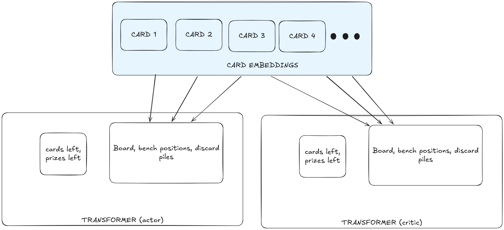
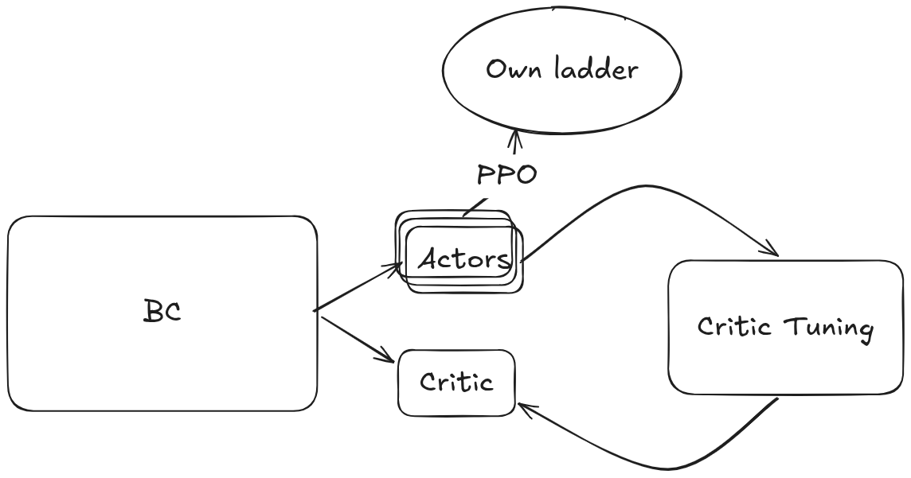

I made a RL bot that plays Pokémon TCG
2026-08-19

I signed up for kaggle competition on [Pokémon TCG](https://www.kaggle.com/competitions/pokemon-tcg-ai-battle). As this is the first time I dabbled with RL and Pokemon, I'm writing about my experience.

The competition rules:

- A simulator is available, so games can be played locally
- Each bot plays a fixed deck
- There is an automatic online ladder where bots play against one another using ELO system
- Kaggle publishes top matches daily

And what makes the competition difficult:

- The search space is massive - archetypes, decks, meta board states, decisions
- Sometimes a game is just unwinnable. Even the best strategy can be countered; there is no single dominant strategy across all matchups
- Meta evolves. A deck might perform extremely well or poorly, depending on the prevalent decks
- Like all card games, non-determinism means sometimes the correct play is to take a chance

I have experience with TCGs, though I had not played Pokemon prior to this competition. The competition ran for about 2 months; and I only started in the second month. I have experience in ML, but not with Reinforcement Learning (RL). I wanted to use this opportunity to get some first-hand experience.

Initially, I thought I could come up with a good rule-based bot without knowing the game. This proved to be fruitless - the obvious rules got me nowhere. I managed to get ~600 rating, which is the rating of the Mega Lucario EX example submission. For comparison, top decks are at 1200+. It was time to deploy ML

So I built an architecture that encodes the state and predicts the next action. I trained it on the dumps of the publicly available games. The network learnt to play all the decks at once. At the time, I was certain this wouldn't produce a solid bot but it was a starting point. This is also known as Behaviour Cloning (BC).

As an experiment, I released this BC network piloting some of the popular decks. To my surprise, it performed surprisingly well. It hit a rating of over 1000. That was at a time when half the ladder was one archetype (Marnie), so the network learnt how to pilot it just by watching what everyone else was doing; without even been tuned to a specific decklist. I got excited as I thought I could improve on it. As the meta evolved, this deck no longer worked as well, though it remained strong.

I will first go over some technical terms. Each deck has a core set - for example dreepy/drakloak/dragapult + a list of cards that never change. This is the "archetype", typically around 45-50 cards. The rest, adding up to 60, are flexible card choices. So I call these choices "variant". So each "archetype" has several "variants". It doesn't make sense to treat two variants of the same archetypes as different decks - there is a shared signal.

Okay, so I have the BC network. I parsed the existing games for analysis - and I found out there are 11 main archetypes with up to 5 variants, picked based on popularity and diversity. Now I would use the variants I picked to tune many different actors; to avoid meta exploitation.

I froze the card embeddings and the critic. Then I started tuning the network for a particular decklist. I used two-tier sampling - for each match, opponent would be sampled based on archetype popularity and then it would randomly choose one of my variants to play against. The winner/losr would get a learning signal through PPO. A self-reinforcing ladder.

I noticed that the signal was way too noisy. Basically, the critic overfit - it had remembered all the board states and was very confident that a board state would lead to win or loss - even for very early turn-1 board states with no clear advantage. That's an inherent issue with training solely on outcomes - you know who won but you don't know how close it was. I fixed it by using my BC network to pilot the two decks, starting from a board position and doing 10 playthroughs with different seeds. The signal feeding into the critic would be smoothed - much better than binary win/lose. This is rather expensive to simulate, so I couldn't really commit to more than 20k board states. Limited, but better than nothing. And it did the job to fix the critic's overconfidence.

Every once in a while, I'd unfreeze and tune the shared critic using 20k board states, sampled from my own agents. Something like alternating actors and critic. As the actors improved, the critic would improve - that was the idea.

Another challenge was that BC had no idea how to play most of the variants and even some of the archetypes. For example, it was achieving sub-20% win rate on Raging Bolt. There's no signal there. I trimmed the bad variants and restarted.

At the end of each training round, I'd do an evaluation with more games and measure the confidence that PPO improved anything. This worked for awhile, and then I'd consistently measure that nothing improved.

By that time, the final weekend loomed and there is an obvious problem. My best decks are still in the 850-900 rating territory, so PPO still hadn't proven itself as an improvement over BC.

A lot happened in the last weekend. I panicked and retried the rule-based approach, as I thought I had a better grasp of the game. This failed, no surprise. Then I probed the training metrics and I realized the network wasn't learning much - the variants had basically plateaued and had stopped changing their learnt policy. I scrambled to find a reason. My best guess is that the learning objective is way too difficult to learn through PPO - there are only a few key decisions at each game and I couldn't find them effectively with the expensive rollouts that a full game requires. Varying the rollout exploration parameters (such as temperature and entropy) just regressed the rollouts and would result in way more losses. I tried a search-based approach that would find winning actions for each loss - but that proved to be too expensive and too slow to collect meaningful number of samples.

In the end, I had to bite the bullet and submit something. I chose two decks that my ladder produced - by that point Marnie had fallen out of favor, and I submitted Dipplin and Crustle. At one point, I reached 50th place - but that was lucky streak and Crustle ultimately settled around rating 900. Dipplin finished around 800.

RL is finicky. There are too many levers to pull, too many metrics to monitor. Worst of all, I could be training on noise - and everything would look stable to my untrained eye.

I did feel like I ran out of time before making RL work. My submission was closer to traditional ML and I don't think RL added much on top, even though I spent most of my time trying. Perhaps I should have focused on a single deck; perhaps there is an uncaught bug somewhere; perhaps I was one decision away from making it work. Nevertheless, I had great fun.

Big thanks to Kaggle and the Pokemon team for the great competition and game
