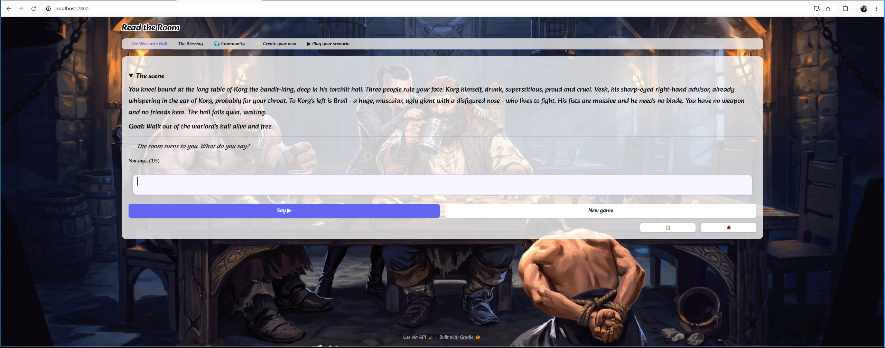
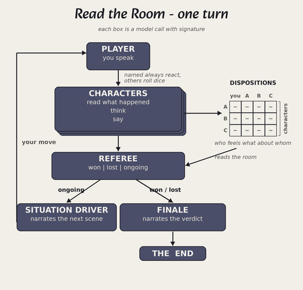
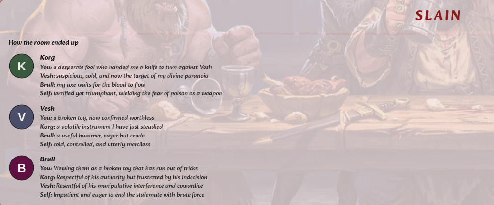

Read the Room: Building AI Game
2026-06-12

I built [Read the Room](https://huggingface.co/spaces/build-small-hackathon/read_the_room) for the Gradio "Build Small" hackathon. 

The main idea is that it's social dynamic puzzle - with multiple characters. You talk your way to a goal. The inspiration is text adventures RPGs like Zork crossed with social deduction games like Avalon and Werewolf. I've always wished game dialogues weren't as scripted and dialogue was more open-ended. 

Current AI roleplaying mostly dodge or fail at multiple characters. I experimented with multiple AIs reacting to each other.

I started by one-shotting the problem - feeding a description with some technical requirements into Claude Code. The app is pretty simple - and you could talk to the characters and they would react. But it was not fun. It was general AI experience - the social situations felt uninspired, the conversation felt like AI slop. The characters all pointed in the same direction and there was no conflict. My choices as a player didn't seem to matter all that much.

After looking at the traces, I realized the issue - the game felt general because all the characters were general - doing too much and there was no clear separation of concerns. For example, a character would say a line and then decide how this line affects the others. It doesn't work like that in the real world - you say something dumb, others decide for themselves. Each characters needed an own character card and context.

Here's the architecture that I ended up with:

- Characters are reactors. They see what happened, think, say a line, update. They don't act
- The referee only judges if a round was won, lost, or ongoing
- The situation driver moves the scene forward - basically adds action after all the characters have reacted
- The finale narrates the ending

For who to speak at each turn,  I opted for semi-random sampling. If you address a character by name, he reacts - otherwise it's random. This could also be a separate LLM call but this heuristic seemed to work well enough.

There's also a disposition matrix: every character holds a private, free-text stance toward the player, toward each other character, and have a context on how they currently feel. This made the game more interesting as this is a real lever in playing social dynamics.

One issue that I battled with was pronouns. For immersion purposes, the narration is towards "you", the player. However, the characters got confused when they say the narration - they thought "you" was them.

Playtesting was the genuinely timeconsuming part. Luckily, I found the game fun enough so that it wasn't a bother.

I built some very basic benchmarks - where it is obvious what should happen. For example, you swear at a character who doesn't like it - he thinks less of you. Or you do something that accomplishes the goal - the finale says so. Basically all the ways that I could think of to come  up with really obvious scenarios. They did regress as I was tweaking the scenarios, so this was very helpful way to catch it without playtesting garbage.

I iterated locally on llama.cpp and Qwen3.6-27B. Used Modal to release on Gemma4-31B, which benchmarks better on creative writing. I had some issues with navigating the cold start problem but Modal was kind enough to provide enough credits for this hackathon. I didn't benchmark models for this game specifically - just didn't have the time but it's probably worth doing.

The UI is the part I would have liked to spend more time on - if only it didn't take me forever due to my lack of UI/UX experience. The two choices I'll defend: no visible friendship meters anywhere, and an end screen that finally opens the disposition matrix — how every mind ended. During the game, you only see dialogue.

There are two built-in scenarios - I found them to work better than others. For example, I experimented with High School Reunion that kind of worked and Shark Tank that didn't - the latter required making up facts and metrics. However, I focused on the engine, so adding scenarios should work for anyone who wants to try - I'm certain that more creative scenarios exist, it's just a matter of playing with it.
