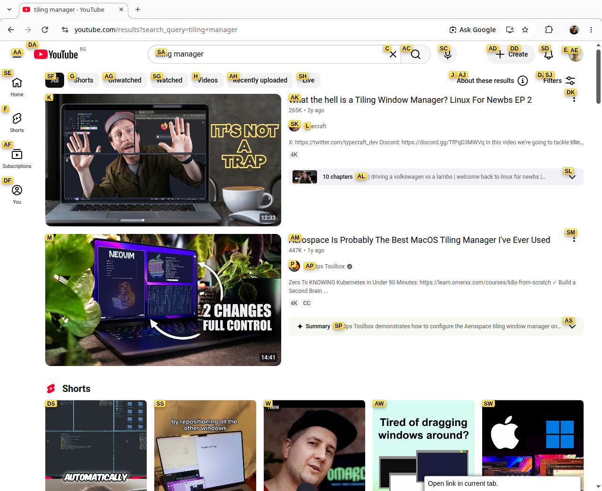
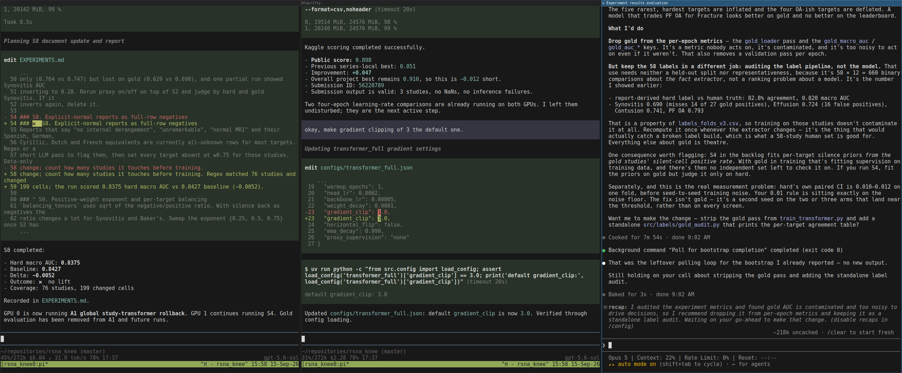
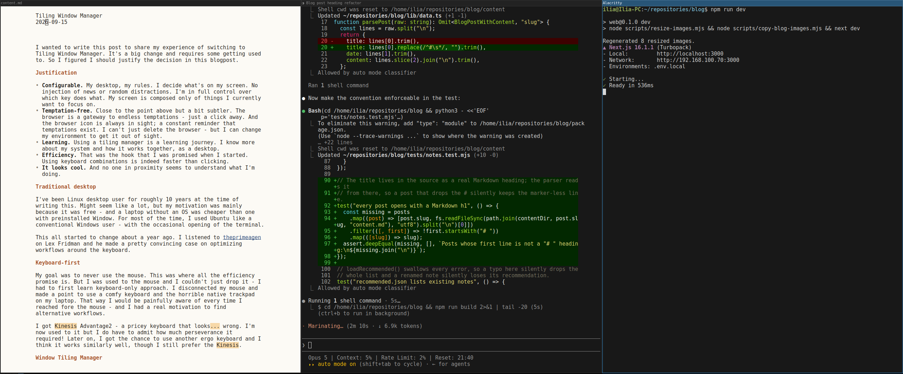

# My Desktop, My Rules
2026-09-15

I wanted to write this post to share my experience of switching to tiling window manager. It's a change from traditional desktop environment and requires some getting used to. So I figured I should justify the decision in this blog post.

## Justification

- **Configurable.** My desktop, my rules. I decide what's on my screen. No injected news or other distractions. I'm in full control over which key does what. My screen is composed only of things I currently want to focus on.
- **Temptation-free.** Related to the point above but a bit subtler. The browser is a gateway to endless temptations - just a click away. And the browser icon is always in sight; a constant reminder that temptations exist. I can't just delete the browser - but I can change my environment to get it out of sight. 
- **Learning.** Using a tiling window manager is a learning journey. I now know more about my system and how the pieces fit together to form a desktop 
- **Efficiency.** That was the hook that drew me in. There's a steep curve but it's absolutely true that using keyboard combinations is indeed faster than reaching for the mouse
- **It looks cool.** And no one around me seems to understand  

## Traditional desktop

I've been a Linux desktop user for roughly 10 years at the time of writing this. That might seem like a lot, but my motivation was mainly that Linux is free - and a laptop without an OS was cheaper than one with preinstalled Windows. For most of that time, I used Ubuntu like a conventional Windows user - with the occasional terminal. 

This all started to change about 18 months ago. I listened to [theprimeagen](https://www.youtube.com/watch?v=tNZnLkRBYA8) on Lex Fridman and he made a pretty convincing case for optimizing workflows around the keyboard.   

## Keyboard-first

My goal was to never use the mouse. That was where the promise of efficiency seemed to be. But I was used to the mouse and I couldn't just drop it - I had to first learn keyboard-only approach. 

I disconnected my mouse and made a point of using a comfy keyboard and the horrible native trackpad on my laptop. That way I would be painfully aware of every time I reached for the trackpad - and I had a real motivation to find alternative workflows.

I got a Kinesis Advantage2 - a pricey keyboard that looks mangled. I'm now used to it but I do have to admit it required perseverance! Later on, I got the chance to use another ergo keyboard and I think it works similarly well, though I still prefer the Kinesis.

## Problems with Desktop

I quickly found two bottlenecks: 

1. The browser - most websites, (i.e. YouTube) are designed around heavy mouse usage. I installed the [Vimium](https://vimium.github.io/) extension. It gives every page's clickable elements a key combination. It works, albeit some websites still feel awkward.
 

2. Multiple applications side by side. My work requires looking at data and code. I could bind applications to a key and quickly switch between them - and that worked reasonable for fullscreen applications. But side-by-side work is awkward and I always defaulted to the trackpad. I had to find an alternative. That's how I found tiling window managers

After some research, i3 seemed easy to try on my trusty Ubuntu, so I gave it a shot. It took me a few days to set up all the configuration and I was quickly convinced that this is a better way of operating. I haven't looked back since.

## Window Tiling manager

The main benefit of using one is that there is no need to drag applications with the mouse. Instead, I manage everything with a keyboard. How does that work? It's similar to tabs. Each application gets a window that works like a tab - and I can cycle through them. For example, here's a window of 3 of my agents working - the right one is currently selected.

Okay, great - but what if my desktop is not exclusive to agents? Well, neither is mine - the workspaces are also tabbed! 

That sounds a bit confusing as the canonical term "workspace" needs explaining. In a regular desktop, the applications can overlap - and there's a single workspace. In a tiling window manager like i3, the applications aren't typically stacked on top of each other - instead they are organized in different workspaces. Only one workspace (per monitor) is visualized at a point in time - but they are switchable with a keypress, like tabs. 

For example, the screenshot above shows my "agent" workspace that has three windows. And here is my "writing" workspace - three more windows running simultaneously, only a keypress away:

Technically, you can have any number of windows in a workspace - but three is what works for me on a single widescreen.

Everything is isolated and reachable with a single key combination. I can have a "distraction" workspace with the browser open - and I have to explicitly switch to it. Out of sight, out of mind. 

*Note: i3 supports "floating" windows and mouse clicking - it's just not the way I use them.* 

## i3bar

When I first saw the status bar in i3, I thought that it was way too minimal, even for me. It barely had anything!

Well, actually i3bar is programmable and extendable. For example, I've configured mine to tell me my system load - GPU, CPU, RAM... In the screenshot above, you can see my system is under CPU and GPU load - as I'm currently training an image model for Kaggle. 

This status bar sits at the bottom of the screen, regardless of the workspace. It contains only the information that I have deemed worthy of my attention. I also made a custom [pomodoro-type](https://github.com/ilia-iliev/pomobar) app that is always on screen and helps me keep track of how much time I've logged as productive each day - that's the far-left one. 

## Final Thoughts

I'm glad I made the effort to learn a tiling window manager at the time I did. My agentic workflows now involve an ever-increasing number of windows working in parallel - and it's easier to keep track.

More importantly, I feel like I have customized my desktop to my liking - and I have stripped away it of all the parts that actively hurt my wandering mind. My desktop now bolsters my attention.

